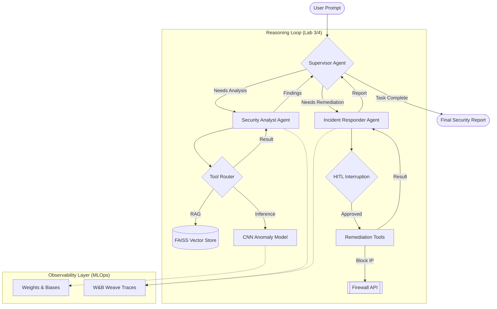

# Architecture_Diagram.md

This diagram illustrates the **System Architecture** focusing on the **LangGraph Reasoning Loop** and the **Multi-Agent Orchestration**.

```mermaid
graph TD
    User([User Prompt]) --> Supervisor{Supervisor Agent}
    
    subgraph "Reasoning Loop (Lab 3/4)"
        Supervisor -- "Needs Analysis" --> Analyst[Security Analyst Agent]
        Analyst --> AnalystTools{Tool Router}
        AnalystTools -- "RAG" --> VectorDB[(FAISS Vector Store)]
        AnalystTools -- "Inference" --> MLModel[CNN Anomaly Model]
        AnalystTools -- "Result" --> Analyst
        Analyst -- "Findings" --> Supervisor
        
        Supervisor -- "Needs Remediation" --> Responder[Incident Responder Agent]
        Responder --> HITL{HITL Interruption}
        HITL -- "Approved" --> ResponderTools[Remediation Tools]
        ResponderTools -- "Block IP" --> Firewall[[Firewall API]]
        ResponderTools -- "Result" --> Responder
        Responder -- "Report" --> Supervisor
    end
    
    Supervisor -- "Task Complete" --> Output([Final Security Report])
    
    subgraph "Observability Layer (MLOps)"
        MLModel -.-> W&B[Weights & Biases]
        Analyst -.-> Weave[W&B Weave Traces]
        Responder -.-> Weave
    end
```
